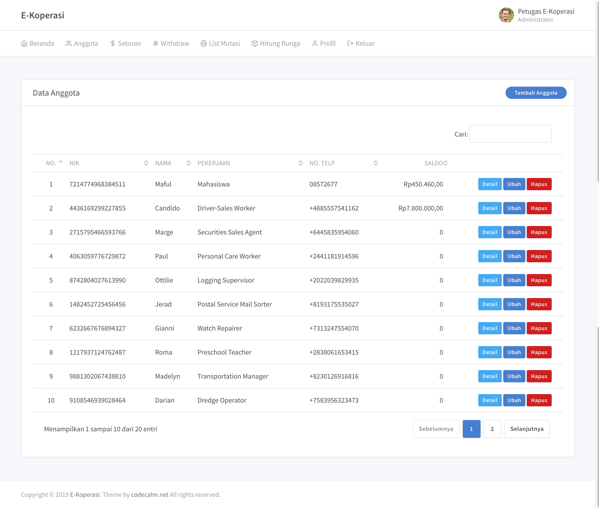

# Sistem Informasi E-Koperasi

Aplikasi manajemen koperasi komprehensif yang dirancang untuk mengelola anggota, nasabah, simpanan, dan pinjaman dengan sistem akuntansi yang terintegrasi.

## Fitur Utama

### Manajemen Pinjaman & Simpanan
- **Metode Perhitungan Bunga**: Mendukung bunga Flat, Efektif, dan Anuitas.
- **Pinjaman Tanpa Tenor (Indefinite)**: Dukungan untuk pinjaman bunga saja dengan pelunasan pokok fleksibel.
- **Pelunasan Total (Settlement)**: Fitur pelunasan dipercepat dengan perhitungan bunga proporsional (prorate).
- **Biaya Admin Periodik**: Otomatisasi pembebanan biaya admin secara berkala (default per 6 bulan).
- **Simpanan Sukarela**: Manajemen setoran dan penarikan tabungan dengan bagi hasil/bunga.

### Dashboard & Penagihan
- **Dashboard Penagihan**: Pemantauan real-time dengan fitur live search dan pengelompokan otomatis berdasarkan Area/Desa.
- **Monitoring Tunggakan**: Perhitungan mendalam untuk tunggakan pokok, bunga, biaya admin, dan denda (penalti).
- **Cetak Data DC (Debt Collector)**: Laporan khusus untuk petugas lapangan yang dikelompokkan per wilayah tugas.
- **Nota Keterlambatan**: Pencetakan surat rincian tunggakan resmi untuk diberikan kepada nasabah.

### Akuntansi & Laporan
- **General Ledger**: Otomatisasi jurnal umum dari setiap transaksi pinjaman, angsuran, dan tabungan.
- **Laporan Keuangan**: Neraca Saldo, Laba Rugi, dan Buku Besar.
- **Laporan Operasional**: Arus Kas, Outstanding Pinjaman, Pinjaman Macet, Pendapatan, dan Laporan Agunan (inventaris jaminan).

### Sistem & Keamanan
- **Backup & Reset**: Fitur pencadangan database otomatis (SQL) dan utilitas reset data sistem yang selektif.
- **Manajemen User**: Pengaturan hak akses untuk admin dan staf.

## Screenshots




## Persyaratan Sistem

- **PHP**: Versi 7.2 atau lebih baru.
- **Database**: MySQL atau MariaDB (Versi 5.7+ direkomendasikan).
- **Web Server**: Apache atau Nginx.

## Panduan Instalasi

### 1. Clone Repositori
```bash
git clone <url-repository-ini>
cd e-koperasi
```

### 2. Instalasi Dependensi
```bash
composer install
```

### 3. Konfigurasi Environment
Salin file `.env.example` menjadi `.env` dan sesuaikan pengaturan database Anda:
```bash
cp .env.example .env
```

### 4. Setup Database & Key
```bash
php artisan key:generate
php artisan migrate
php artisan db:seed
php artisan storage:link
```

### 5. Jalankan Aplikasi
```bash
php artisan serve
```
Akses aplikasi melalui browser di alamat: `http://localhost:8000`

## Akun Login Default

- **Email**: `ekoperasi@gmail.com`
- **Password**: `secret`

## Troubleshooting

- **Error Permission/Izin Folder**: Pastikan folder `storage` dan `bootstrap/cache` memiliki izin tulis (writable).
  - Linux/Mac: `chmod -R 775 storage bootstrap/cache`
- **Tampilan Rusak/CSS Tidak Load**: Pastikan URL aplikasi di `.env` (`APP_URL`) sesuai dengan alamat akses Anda.
- **Composer Error**: Jika `composer install` gagal, pastikan ekstensi PHP yang dibutuhkan (seperti `php-xml`, `php-mbstring`, `php-zip`) sudah aktif.

---
© 2024 Sistem Informasi E-Koperasi.
