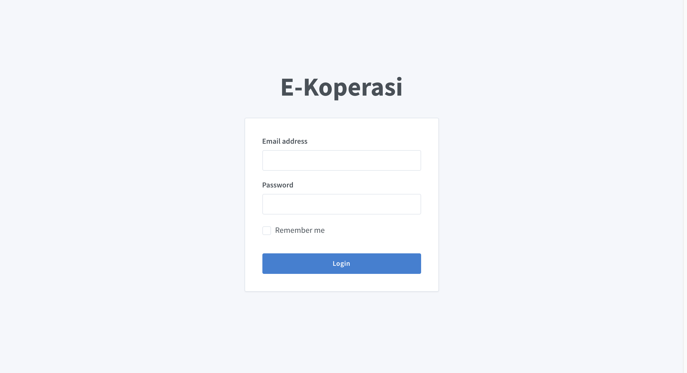
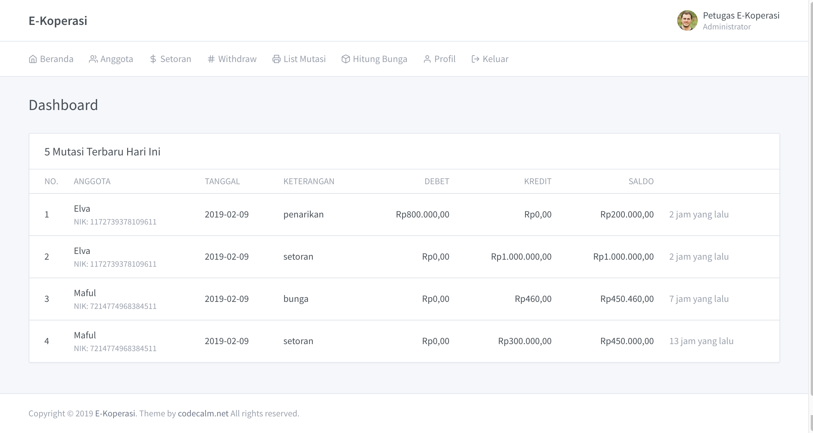

## E-COOPERATIVE

Aplikasi manajemen deposit dan penarikan dengan jenis Simpanan Sukarela dengan bunga 6% per tahun.

## Instalasi

- Clone atau unduh proyek
- Instal dependensi dengan Composer `composer install`
- Salin file environment `cp .env.example .env`
- Generate key `php artisan key:generate`
- Buat database, misalnya `cooperative`, lalu ubah nilai DB_DATABASE di file .env
- Migrasi database `php artisan migrate`
- Masukkan data dummy `php artisan db:seed`
- Jalankan aplikasi `php artisan serve`

## Penggunaan

Kredensial bawaan:

```
Email : ekoperasi@gmail.com
Password : secret
```

## Screenshots






More [screenshots](./screenshots)
